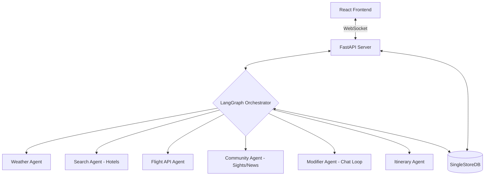

# AI Travel Agent

A production-grade AI travel planning system powered by **LangGraph**, **SerpAPI**, and **SingleStore**, with a premium **React (Next.js)** frontend.

## 🚀 Key Features

- ⚡ **Real-time Streaming**: Progressive rendering of results (Weather -> Flights -> Hotels -> Sights) via WebSockets.
- 💬 **Interactive Chatbot**: Refine your hotel preferences and itinerary style in real-time (e.g., "Find cheaper hotels" or "Make it more adventurous").
- 📸 **Community & Local Insights**: Rich data for top sights, local gems, news, and neighborhood discussions via SerpAPI expansion.
- 🌤️ **Local Weather**: Live weather forecasts and summaries for your destination.
- ✈️ **Enhanced Flight Search**: Google Flights integration with carbon emissions, amenities, and detailed layover info.
- 🏨 **Smart Hotel Recommendations**: Personalized hotel picks matching your budget and rating preferences.
- 📝 **Beautiful Itineraries**: AI-generated day-by-day plans rendered with a polished Markdown interface.
- 💾 **Persistent Memory**: SingleStoreDB for high-performance caching and historical trip persistence.

## 🏗️ Architecture



## 🛠️ Setup

### 1. Prerequisites

- Python 3.9+
- Node.js 18+
- SingleStore Database (Cloud or Self-hosted)
- API Keys:
  - OpenAI API Key
  - SerpAPI Key
  - OpenWeatherMap API Key

### 2. Backend Setup

```bash
cd AI-Travel-Agent

# Create virtual environment
python3 -m venv venv
source venv/bin/activate  # On Windows: venv\Scripts\activate

# Install dependencies
pip install -r requirements.txt

# Configure environment
cp .env.example .env
# Edit .env with your keys
```

### 3. Frontend Setup

```bash
cd frontend

# Install dependencies
npm install

# Run development server
npm run dev
```

### 4. Run the Application

**Terminal 1 - Backend API:**
```bash
source venv/bin/activate
python -m uvicorn api.server:app --reload --port 8000
```

**Terminal 2 - Frontend:**
```bash
cd frontend
npm run dev
```

Visit: `http://localhost:3000`

## 📂 Project Structure

```
AI-Travel-Agent/
├── agents/
│   ├── tools/
│   │   └── serp_tools.py       # Expanded SerpAPI wrappers
│   ├── community_agent.py      # Sights, Local, News, Forums
│   ├── modifier_agent.py       # Chat feedback interpreter
│   ├── search_agent.py         # Google Hotels logic
│   ├── flight_api_agent.py     # Google Flights logic
│   ├── itinerary_agent.py      # Prompt-engineered generation
│   └── weather_agent.py        # Weather & Geocoding
├── database/
│   ├── init_db.py              # Normalized schema definition
│   ├── ops.py                  # Persistence & Cache logic
│   └── singlestore_client.py   # Connection pooling
├── api/
│   └── server.py               # FastAPI & WebSocket streaming
├── state.py                    # Pydantic TravelState model
├── graph.py                    # LangGraph node & edge definition
└── frontend/                   # Next.js 15+ App Router
    └── app/
        ├── components/         # Premium UI Components
        └── page.tsx            # Real-time dashboard
```

## 📊 Database Schema

### `trip_plans` (Parent)
Stores core search parameters and user preferences.

### `flights`, `accommodations`, `weather` (Children)
Stored normalized data with rich JSON details for caching.

### `top_sights`, `local_places`, `local_news`, `discussions` (New)
Expanded tables for community-driven local insights.

## 📝 License

MIT
