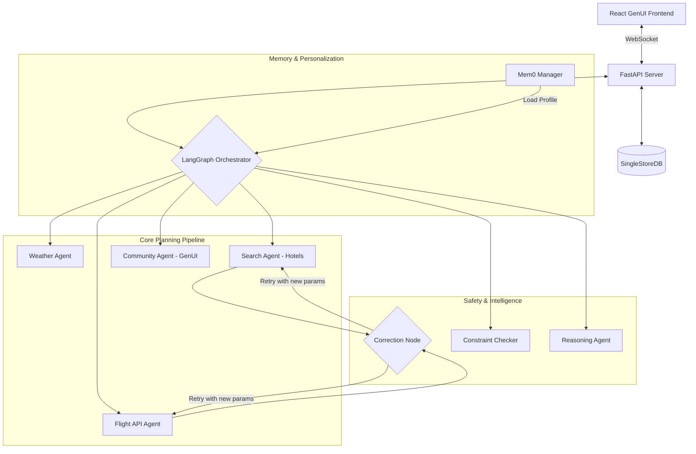

# AI Travel Agent (Generation 2.0)

A production-grade AI travel planning system powered by **LangGraph**, **SerpAPI**, **SingleStore**, and **Mem0**, featuring a **Generative UI** and **Self-Correcting Agents**.

## 🚀 Key Features (v2.1)

### 🛡️ Security & Guardrails
- **DeepEval Toxicity Checks**: Real-time LLM-based detection of harmful/sexual content using `ToxicityMetric`.
- **PII Masking**: "Firewall" regex layer automatically redacts credit cards, emails, and passport IDs.
- **Prompt Injection Defense**: Heuristic detection blocks jailbreak attempts (e.g., "Ignore previous instructions").

### ⚡ Reliability & Performance
- **Exponential Backoff**: API calls (SerpAPI) automatically retry with increasing delays upon failure.
- **Model Fallback**: Auto-switches from GPT-4o -> Claude 3.5 -> Llama 3 if the primary model fails.
- **Local Weather Conversion**: Fetches metric data once and calculates Fahrenheit locally, toggleable by user.

### 🧠 Intelligent & Personalized
- **Long-Term Memory (Mem0)**: Remembers your preferences across sessions (e.g., "I hate hostels", "I prefer Delta").
- **Strict Preference Extraction**: Uses LLMs to strictly enforce complex rules like "Star Alliance Only" or "No Low Cost Carriers".
- **Reasoning Engine**: Analyzes the final trip to provide proactive "Agent Insights" (e.g., warning about weather or layovers).

### ✨ Generative UI
- **Dynamic Widgets**: The frontend doesn't just render static cards; the agents decide *what* to show (News Cards, Video Widgets, Place Cards) based on the search results.
- **Real-time Streaming**: Progressive rendering of results via WebSockets.

### 🛡️ Robust Architecture
- **Self-Correction Layer**: If searches fail (e.g., no flights found), the agent automatically adjusts parameters (nearby airports, flexible dates) and retries.
- **Constraint Validation**: Checks your budget and time constraints before finalizing the plan.

### 🌍 Comprehensive Planning
- **Community Insights**: Sights, local gems, news, and neighborhood discussions.
- **Live Weather**: Forecasts and summaries.
- **Smart Search**: Google Flights & Hotels integration with rich metadata.

## 🏗️ Architecture



## 🛠️ Setup

### 1. Prerequisites

- Python 3.9+
- Node.js 18+
- SingleStore Database (Cloud or Self-hosted)
- **API Keys**:
  - `OPENAI_API_KEY`
  - `SERPAPI_API_KEY`
  - `OPENWEATHER_API_KEY`
  - `MEM0_API_KEY` (Optional, for cloud memory)

### 2. Backend Setup

```bash
cd AI-Travel-Agent

# Create virtual environment
python3 -m venv venv
source venv/bin/activate  # On Windows: venv\Scripts\activate

# Install dependencies
pip install -r requirements.txt

# Configure environment
cp .env.example .env
# Edit .env and ADD: MEM0_API_KEY=your_key
```

### 3. Frontend Setup

```bash
cd frontend

# Install dependencies
npm install

# Run development server
npm run dev
```

### 4. Run the Application

**Terminal 1 - Backend API:**
```bash
source venv/bin/activate
python -m uvicorn api.server:app --reload --port 8000
```

**Terminal 2 - Frontend:**
```bash
cd frontend
npm run dev
```

Visit: `http://localhost:3000`

## 📂 Project Structure

```
AI-Travel-Agent/
├── agents/
│   ├── tools/                  # SerpAPI tools
│   ├── community_agent.py      # Generates GenUI Widgets
│   ├── correction_agent.py     # Heuristic Retry Logic
│   ├── reasoning_agent.py      # Post-trip Analysis
│   ├── flight_api_agent.py     # LLM-based Airline Filtering
│   ├── modifier_agent.py       # Chat & Memory Saver
│   └── ...
├── utils/
│   ├── memory.py               # Mem0 Integration
│   └── logger.py
├── frontend/app/
│   ├── components/
│   │   ├── widgets/            # GenUI Components (News, Video, Place)
│   │   └── DynamicWidget.tsx   # Widget Dispatcher
│   └── page.tsx                # Main Chat Interface
├── graph.py                    # Advanced LangGraph Flow
├── state.py                    # TravelState with Generated UI support
└── ...
```

## 📝 License

MIT
